# STATUS System Infrastructure Documentation
# Documentación de la Infraestructura del Sistema STATUS

---

## 📋 Table of Contents / Tabla de Contenidos

- [English Version](#english-version)
  - [Overview](#overview)
  - [System Architecture](#system-architecture)
  - [Services Description](#services-description)
  - [Network Architecture](#network-architecture)
  - [Deployment Modes](#deployment-modes)
  - [Port Mapping](#port-mapping)
  - [Service Dependencies](#service-dependencies)
  - [Data Persistence](#data-persistence)
  - [Security Considerations](#security-considerations)
  - [Deployment Process](#deployment-process)

- [Versión en Español](#versión-en-español)
  - [Resumen General](#resumen-general)
  - [Arquitectura del Sistema](#arquitectura-del-sistema)
  - [Descripción de Servicios](#descripción-de-servicios)
  - [Arquitectura de Red](#arquitectura-de-red)
  - [Modos de Despliegue](#modos-de-despliegue)
  - [Mapeo de Puertos](#mapeo-de-puertos)
  - [Dependencias entre Servicios](#dependencias-entre-servicios)
  - [Persistencia de Datos](#persistencia-de-datos)
  - [Consideraciones de Seguridad](#consideraciones-de-seguridad)
  - [Proceso de Despliegue](#proceso-de-despliegue)

---

# English Version

## Overview

STATUS is a compliance and governance monitoring system built with a microservices architecture using Docker containers. The infrastructure supports two deployment modes (development and production) and integrates multiple specialized services for data management, workflow automation, monitoring, and API services.

### Key Features

- **Microservices Architecture**: Modular design with independent, scalable services
- **Dual Deployment Modes**: Development (local build) and Production (registry images)
- **Automated Workflows**: Node-RED integration for business process automation
- **Real-time Monitoring**: Grafana dashboards with PostgreSQL backend
- **High-performance Caching**: Dragonfly (Redis-compatible) for session and data caching
- **Governance Integration**: Governify director and registry services
- **Container Orchestration**: Docker Compose for simplified deployment

---

## System Architecture

### High-Level Architecture Diagram


### Technology Stack

| Layer | Technologies |
|-------|-------------|
| **Frontend** | React, Vite, Nginx (production) |
| **Backend** | Node.js, Express |
| **Workflow Automation** | Node-RED |
| **Databases** | PostgreSQL, MongoDB |
| **Caching** | Dragonfly (Redis-compatible) |
| **Monitoring** | Grafana |
| **Governance** | Governify (Director + Registry) |
| **Reverse Proxy** | Nginx (production only) |
| **Orchestration** | Docker Compose |

---

## Services Description

### Core Application Services

#### 1. **status-backend**
- **Purpose**: Main API server handling business logic and data operations
- **Technology**: Node.js
- **Port**: 3001
- **Key Features**:
  - RESTful API with `/api/v1` prefix
  - JWT-based authentication
  - GitHub OAuth integration
  - OpenAI integration for AI features
  - Grafana API integration
  - Session management with Dragonfly/Redis

#### 2. **status-frontend**
- **Purpose**: User interface and client-side application
- **Technology**: React with Vite build tool
- **Port**: 80 (internal), 3000 (external via proxy in prod)
- **Key Features**:
  - Modern SPA (Single Page Application)
  - Environment-specific configuration
  - Responsive design
  - Integration with backend API

#### 3. **reverse-proxy** (Production only)
- **Purpose**: Traffic routing and load distribution
- **Technology**: Nginx
- **Port**: 3000 (external)
- **Routes**:
  - `/` → Frontend (status-frontend:80)
  - `/backend/*` → Backend API (status-backend:3001/api/v1/)
  - `/node-red/*` → Node-RED (nodered:1880)
  - `/grafana/*` → Grafana (grafana:3000)
- **Features**:
  - WebSocket support for Node-RED and Grafana
  - Static asset caching (30 days)
  - 50MB max upload size

### Workflow and Automation

#### 4. **nodered**
- **Purpose**: Visual workflow automation and integration
- **Technology**: Node-RED
- **Port**: 1880
- **Key Features**:
  - Flow-based programming
  - Integration with backend services
  - Blockchain ledger endpoint support
  - Persistent flow storage

### Data Storage Services

#### 5. **postgres**
- **Purpose**: Primary relational database
- **Technology**: PostgreSQL 17.2
- **Port**: 5432
- **Key Features**:
  - Main application data storage
  - Grafana user and configuration data
  - Initialized with custom schema (`init.sql`)
  - Health checks for service availability

#### 6. **mongo-registry**
- **Purpose**: Document database for Governify registry
- **Technology**: MongoDB
- **Port**: 5001
- **Key Features**:
  - Governify registry data storage
  - Authenticated access
  - Persistent volume storage

#### 7. **dragonfly**
- **Purpose**: High-performance in-memory data store
- **Technology**: Dragonfly (Redis-compatible)
- **Port**: 6379
- **Key Features**:
  - Session management
  - Caching layer
  - Redis protocol compatibility
  - Persistent data storage

### Monitoring and Visualization

#### 8. **grafana**
- **Purpose**: Monitoring dashboards and data visualization
- **Technology**: Grafana OSS
- **Port**: 3100
- **Key Features**:
  - PostgreSQL data source provisioning
  - Custom dashboard support
  - Service account API access
  - Pre-configured datasources

### Governance Services

#### 9. **director**
- **Purpose**: Governify director service for governance orchestration
- **Technology**: Governify Director
- **Port**: 5800
- **Key Features**:
  - Infrastructure coordination
  - MongoDB logging
  - Health monitoring

#### 10. **registry**
- **Purpose**: Governify registry for governance agreements
- **Technology**: Governify Registry
- **Port**: 5400
- **Key Features**:
  - Agreement storage and management
  - MongoDB backend
  - Static file serving
  - OAST TLM module support

---

## Network Architecture

The infrastructure uses three isolated Docker networks for security and performance:

### 1. **web_network**
- **Purpose**: Frontend, backend, and proxy communication
- **Connected Services**:
  - status-frontend
  - status-backend
  - reverse-proxy (prod only)
  - nodered
  - grafana

### 2. **db_network**
- **Purpose**: Database services communication
- **Connected Services**:
  - status-backend
  - postgres
  - grafana
  - dragonfly
  - director
  - registry
  - mongo-registry

### 3. **nodered_network**
- **Purpose**: Node-RED integration network
- **Connected Services**:
  - status-backend
  - nodered

### Network Isolation Benefits

- **Security**: Services only communicate on required networks
- **Performance**: Reduced broadcast domain size
- **Maintenance**: Easier to troubleshoot and update individual networks
- **Scalability**: Networks can be independently scaled

---

## Deployment Modes

### Development Mode (`dev`)

**Purpose**: Local development and testing

**Characteristics**:
- Builds images from local source code
- Requires `status-backend` and `frontend` repositories cloned alongside infrastructure
- No reverse proxy (direct port access)
- Hot reload support
- Environment: `NODE_ENV=development`
- Frontend accessible at: `http://localhost:3000`
- Backend accessible at: `http://localhost:3001`

**Docker Compose File**: `docker-compose.dev.yml`

**Build Context**:
```yaml
backend:  ../status-backend/Dockerfile
frontend: ../frontend/Dockerfile
```

### Production Mode (`prod`)

**Purpose**: Production deployment

**Characteristics**:
- Uses pre-built images from container registries
  - Backend: `statuscompliance/status-backend:latest`
  - Frontend: `ghcr.io/statuscompliance/frontend:latest`
- Includes Nginx reverse proxy
- Optimized for performance
- Environment: `NODE_ENV=production`
- All services accessible through: `http://localhost:3000`

**Docker Compose File**: `docker-compose.prod.yml`

**Registry Images**:
```yaml
backend:  statuscompliance/status-backend:latest
frontend: ghcr.io/statuscompliance/frontend:latest
```

---

## Port Mapping

### External Ports (Host Access)

| Port | Service | Purpose | Access |
|------|---------|---------|--------|
| **3000** | Frontend/Proxy | Main application entry | http://localhost:3000 |
| **3001** | Backend API | REST API | http://localhost:3001/api/v1 |
| **1880** | Node-RED | Workflow editor | http://localhost:1880 |
| **3100** | Grafana | Monitoring dashboard | http://localhost:3100 |
| **5001** | MongoDB | Registry database | localhost:5001 |
| **5400** | Registry | Governify registry | http://localhost:5400 |
| **5432** | PostgreSQL | Database | localhost:5432 |
| **5800** | Director | Governify director | http://localhost:5800 |
| **6379** | Dragonfly | Redis cache | localhost:6379 |

### Internal Ports (Container Communication)

Most services communicate internally using their default ports:
- Frontend: 80
- Backend: 3001
- Node-RED: 1880
- Grafana: 3000
- PostgreSQL: 5432
- MongoDB: 27017
- Dragonfly: 6379

---

## Service Dependencies

### Startup Order and Health Checks

The infrastructure uses Docker Compose `depends_on` with health conditions to ensure proper startup order:


### Health Check Endpoints

- **Backend**: `http://127.0.0.1:3001` (wget check)
- **Frontend**: `http://127.0.0.1:80/` (curl check)
- **Node-RED**: `http://127.0.0.1:1880` (curl check)
- **PostgreSQL**: `pg_isready` command
- **MongoDB**: `mongosh ping` command
- **Dragonfly**: `redis-cli ping` command
- **Director**: `http://127.0.0.1:80/info` (wget check)

---

## Data Persistence

### Docker Volumes

The infrastructure uses named volumes for data persistence:

| Volume Name | Service | Purpose | Data Type |
|-------------|---------|---------|-----------|
| **postgres** | postgres | Database files | Application data, user data |
| **grafana-status** | grafana | Grafana config and dashboards | Dashboard configs, users |
| **node-red-status** | nodered | Node-RED flows and config | Workflows, credentials |
| **dragonfly-data** | dragonfly | Cache data | Session data, cache |
| **registry-data** | mongo-registry | MongoDB data | Governance agreements |

### Volume Mounts

```yaml
postgres:
  - postgres:/var/lib/postgresql/data
  - ./config/init.sql:/docker-entrypoint-initdb.d/init.sql

grafana:
  - grafana:/var/lib/grafana
  - ./config:/etc/grafana/provisioning/datasources
  - ./config/grafana.ini:/etc/grafana/grafana.ini

nodered:
  - ./node-red-status:/data

registry:
  - ../logs/registry:/opt/app/logs
  - ../static:/opt/app/public/static
```

---

## Security Considerations

### Authentication and Authorization

1. **JWT Tokens**: Backend uses JWT for stateless authentication
   - Access tokens with configurable expiration
   - Refresh tokens for token renewal
   - Secrets configurable via environment variables

2. **GitHub OAuth**: Social login integration
   - Client ID and Secret configuration required
   - Secure callback handling

3. **Database Access**:
   - PostgreSQL: User-based authentication
   - MongoDB: Root username/password
   - Credentials stored in environment variables

4. **Grafana**:
   - Admin credentials configurable
   - Service account with API key
   - API key auto-generated during setup

### Network Security

- **Network Isolation**: Three separate networks limiting inter-service communication
- **Port Exposure**: Only necessary ports exposed to host
- **Health Checks**: Ensures only healthy services receive traffic

### Environment Variables

Sensitive data managed through `.env` file:
- API keys (OpenAI, Grafana)
- Database passwords
- JWT secrets
- OAuth credentials
- Service credentials

### Best Practices Implemented

- No hardcoded credentials in compose files
- Health checks for all critical services
- Restart policies (`unless-stopped`) for resilience
- Resource limits (memory) on select services
- Volume-based persistence (no ephemeral data)

---

## Deployment Process

### Automated Setup Flow

The `setup.sh` script automates the entire deployment:


### Manual Deployment Commands

**Development**:
```bash
docker compose -f docker-compose.dev.yml up
```

**Production**:
```bash
docker compose -f docker-compose.prod.yml up
```

### Pre-deployment Requirements

1. **Docker** (>= 21.0.0)
2. **Environment Configuration**:
   - OpenAI API Key
   - OpenAI Organization ID
   - GitHub Client Secret
3. **For Development Mode**:
   - `status-backend` repository cloned at `../status-backend`
   - `frontend` repository cloned at `../frontend`

### Post-deployment Verification

1. Check container status: `docker ps`
2. View logs: `docker logs <container_name>`
3. Access services:
   - Main app: http://localhost:3000
   - Backend API: http://localhost:3001/api/v1
   - Node-RED: http://localhost:1880
   - Grafana: http://localhost:3100

---

## Troubleshooting

### Common Issues

**Issue**: Containers fail to start
- **Solution**: Check Docker version, ensure all required environment variables are set

**Issue**: Health checks failing
- **Solution**: Check service logs, verify database connections

**Issue**: Port conflicts
- **Solution**: Ensure ports 3000, 3001, 1880, 3100, 5001, 5400, 5432, 5800, 6379 are available

**Issue**: Build fails in dev mode
- **Solution**: Verify backend and frontend repositories are cloned in correct locations

### Useful Commands

```bash
# View all container logs
docker compose logs -f

# View specific service logs
docker logs status-backend -f

# Restart a service
docker compose restart <service_name>

# Rebuild and restart
docker compose up --build -d

# Stop all services
docker compose down

# Stop and remove volumes (⚠️ deletes data)
docker compose down -v
```

---

## Maintenance

### Updating Services

**Pull latest images (prod mode)**:
```bash
docker compose -f docker-compose.prod.yml pull
docker compose -f docker-compose.prod.yml up -d
```

**Rebuild from source (dev mode)**:
```bash
docker compose -f docker-compose.dev.yml up --build -d
```

### Backup and Recovery

**Backup volumes**:
```bash
docker run --rm \
  -v postgres:/data \
  -v $(pwd):/backup \
  alpine tar czf /backup/postgres-backup.tar.gz /data
```

**Restore volumes**:
```bash
docker run --rm \
  -v postgres:/data \
  -v $(pwd):/backup \
  alpine tar xzf /backup/postgres-backup.tar.gz -C /
```

### Resource Limits

Current memory limits:
- grafana: 400 MB
- director: 400 MB
- registry: 400 MB
- mongo-registry: 2000 MB

---

## Architecture Decisions

### Why Dragonfly over Redis?

- Better performance characteristics
- Redis protocol compatibility (drop-in replacement)
- Lower memory footprint
- Active development and modern codebase

### Why Separate Networks?

- Enhanced security through isolation
- Reduced attack surface
- Clear service boundaries
- Easier to audit and monitor traffic

### Why Node-RED?

- Visual workflow design
- Low-code integration platform
- Extensive node library
- Real-time processing capabilities
- Easy integration with external services

### Why Governify Services?

- Governance agreement management
- SLA monitoring and compliance
- Integration with development workflows
- Auditable governance processes

---

## Future Enhancements

### Planned Improvements

1. **SSL/TLS Support**: HTTPS configuration with Let's Encrypt
2. **Horizontal Scaling**: Load balancer and multiple backend instances
3. **Monitoring**: Prometheus metrics and alerting
4. **Logging**: Centralized logging with ELK stack
5. **CI/CD**: Automated testing and deployment pipelines
6. **Backup Automation**: Scheduled backups with retention policies
7. **High Availability**: Database replication and failover

---

## License

This infrastructure is part of the STATUS system. See [LICENSE](LICENSE) for details.

---

## Support

For issues, questions, or contributions:
- GitHub: [statuscompliance/infrastructure](https://github.com/statuscompliance/infrastructure)

---

---

# Versión en Español

## Resumen General

STATUS es un sistema de monitoreo de cumplimiento y gobernanza construido con una arquitectura de microservicios utilizando contenedores Docker. La infraestructura soporta dos modos de despliegue (desarrollo y producción) e integra múltiples servicios especializados para gestión de datos, automatización de flujos de trabajo, monitoreo y servicios API.

### Características Principales

- **Arquitectura de Microservicios**: Diseño modular con servicios independientes y escalables
- **Modos de Despliegue Duales**: Desarrollo (construcción local) y Producción (imágenes de registro)
- **Flujos de Trabajo Automatizados**: Integración de Node-RED para automatización de procesos de negocio
- **Monitoreo en Tiempo Real**: Dashboards de Grafana con backend PostgreSQL
- **Caché de Alto Rendimiento**: Dragonfly (compatible con Redis) para caché de sesiones y datos
- **Integración de Gobernanza**: Servicios director y registry de Governify
- **Orquestación de Contenedores**: Docker Compose para despliegue simplificado

---

## Arquitectura del Sistema

### Diagrama de Arquitectura de Alto Nivel


### Stack Tecnológico

| Capa | Tecnologías |
|------|-------------|
| **Frontend** | React, Vite, Nginx (producción) |
| **Backend** | Node.js, Express |
| **Automatización de Flujos** | Node-RED |
| **Bases de Datos** | PostgreSQL, MongoDB |
| **Caché** | Dragonfly (compatible con Redis) |
| **Monitoreo** | Grafana |
| **Gobernanza** | Governify (Director + Registry) |
| **Proxy Inverso** | Nginx (solo producción) |
| **Orquestación** | Docker Compose |

---

## Descripción de Servicios

### Servicios Principales de la Aplicación

#### 1. **status-backend**
- **Propósito**: Servidor API principal que maneja la lógica de negocio y operaciones de datos
- **Tecnología**: Node.js
- **Puerto**: 3001
- **Características Clave**:
  - API RESTful con prefijo `/api/v1`
  - Autenticación basada en JWT
  - Integración con OAuth de GitHub
  - Integración con OpenAI para funciones de IA
  - Integración con API de Grafana
  - Gestión de sesiones con Dragonfly/Redis

#### 2. **status-frontend**
- **Propósito**: Interfaz de usuario y aplicación del lado del cliente
- **Tecnología**: React con herramienta de construcción Vite
- **Puerto**: 80 (interno), 3000 (externo vía proxy en prod)
- **Características Clave**:
  - SPA moderna (Single Page Application)
  - Configuración específica por entorno
  - Diseño responsivo
  - Integración con API backend

#### 3. **reverse-proxy** (Solo producción)
- **Propósito**: Enrutamiento de tráfico y distribución de carga
- **Tecnología**: Nginx
- **Puerto**: 3000 (externo)
- **Rutas**:
  - `/` → Frontend (status-frontend:80)
  - `/backend/*` → API Backend (status-backend:3001/api/v1/)
  - `/node-red/*` → Node-RED (nodered:1880)
  - `/grafana/*` → Grafana (grafana:3000)
- **Características**:
  - Soporte para WebSocket en Node-RED y Grafana
  - Caché de assets estáticos (30 días)
  - Tamaño máximo de subida de 50MB

### Flujos de Trabajo y Automatización

#### 4. **nodered**
- **Propósito**: Automatización visual de flujos de trabajo e integración
- **Tecnología**: Node-RED
- **Puerto**: 1880
- **Características Clave**:
  - Programación basada en flujos
  - Integración con servicios backend
  - Soporte para endpoint de ledger blockchain
  - Almacenamiento persistente de flujos

### Servicios de Almacenamiento de Datos

#### 5. **postgres**
- **Propósito**: Base de datos relacional principal
- **Tecnología**: PostgreSQL 17.2
- **Puerto**: 5432
- **Características Clave**:
  - Almacenamiento de datos de aplicación principal
  - Datos de usuario y configuración de Grafana
  - Inicializado con esquema personalizado (`init.sql`)
  - Verificaciones de salud para disponibilidad del servicio

#### 6. **mongo-registry**
- **Propósito**: Base de datos de documentos para el registry de Governify
- **Tecnología**: MongoDB
- **Puerto**: 5001
- **Características Clave**:
  - Almacenamiento de datos del registry de Governify
  - Acceso autenticado
  - Almacenamiento en volumen persistente

#### 7. **dragonfly**
- **Propósito**: Almacén de datos en memoria de alto rendimiento
- **Tecnología**: Dragonfly (compatible con Redis)
- **Puerto**: 6379
- **Características Clave**:
  - Gestión de sesiones
  - Capa de caché
  - Compatibilidad con protocolo Redis
  - Almacenamiento de datos persistente

### Monitoreo y Visualización

#### 8. **grafana**
- **Propósito**: Dashboards de monitoreo y visualización de datos
- **Tecnología**: Grafana OSS
- **Puerto**: 3100
- **Características Clave**:
  - Aprovisionamiento de fuente de datos PostgreSQL
  - Soporte para dashboards personalizados
  - Acceso API mediante cuenta de servicio
  - Datasources preconfiguradas

### Servicios de Gobernanza

#### 9. **director**
- **Propósito**: Servicio director de Governify para orquestación de gobernanza
- **Tecnología**: Governify Director
- **Puerto**: 5800
- **Características Clave**:
  - Coordinación de infraestructura
  - Registro en MongoDB
  - Monitoreo de salud

#### 10. **registry**
- **Propósito**: Registry de Governify para acuerdos de gobernanza
- **Tecnología**: Governify Registry
- **Puerto**: 5400
- **Características Clave**:
  - Almacenamiento y gestión de acuerdos
  - Backend MongoDB
  - Servicio de archivos estáticos
  - Soporte para módulo OAST TLM

---

## Arquitectura de Red

La infraestructura utiliza tres redes Docker aisladas para seguridad y rendimiento:

### 1. **web_network**
- **Propósito**: Comunicación entre frontend, backend y proxy
- **Servicios Conectados**:
  - status-frontend
  - status-backend
  - reverse-proxy (solo prod)
  - nodered
  - grafana

### 2. **db_network**
- **Propósito**: Comunicación de servicios de base de datos
- **Servicios Conectados**:
  - status-backend
  - postgres
  - grafana
  - dragonfly
  - director
  - registry
  - mongo-registry

### 3. **nodered_network**
- **Propósito**: Red de integración de Node-RED
- **Servicios Conectados**:
  - status-backend
  - nodered

### Beneficios del Aislamiento de Red

- **Seguridad**: Los servicios solo se comunican en las redes requeridas
- **Rendimiento**: Tamaño de dominio de broadcast reducido
- **Mantenimiento**: Más fácil de solucionar y actualizar redes individuales
- **Escalabilidad**: Las redes pueden escalarse independientemente

---

## Modos de Despliegue

### Modo Desarrollo (`dev`)

**Propósito**: Desarrollo local y pruebas

**Características**:
- Construye imágenes desde código fuente local
- Requiere repositorios `status-backend` y `frontend` clonados junto a infrastructure
- Sin proxy inverso (acceso directo por puerto)
- Soporte para recarga en caliente
- Entorno: `NODE_ENV=development`
- Frontend accesible en: `http://localhost:3000`
- Backend accesible en: `http://localhost:3001`

**Archivo Docker Compose**: `docker-compose.dev.yml`

**Contexto de Construcción**:
```yaml
backend:  ../status-backend/Dockerfile
frontend: ../frontend/Dockerfile
```

### Modo Producción (`prod`)

**Propósito**: Despliegue en producción

**Características**:
- Usa imágenes preconstruidas de registros de contenedores
  - Backend: `statuscompliance/status-backend:latest`
  - Frontend: `ghcr.io/statuscompliance/frontend:latest`
- Incluye proxy inverso Nginx
- Optimizado para rendimiento
- Entorno: `NODE_ENV=production`
- Todos los servicios accesibles a través de: `http://localhost:3000`

**Archivo Docker Compose**: `docker-compose.prod.yml`

**Imágenes de Registro**:
```yaml
backend:  statuscompliance/status-backend:latest
frontend: ghcr.io/statuscompliance/frontend:latest
```

---

## Mapeo de Puertos

### Puertos Externos (Acceso desde Host)

| Puerto | Servicio | Propósito | Acceso |
|--------|----------|-----------|--------|
| **3000** | Frontend/Proxy | Entrada principal de la aplicación | http://localhost:3000 |
| **3001** | Backend API | API REST | http://localhost:3001/api/v1 |
| **1880** | Node-RED | Editor de flujos de trabajo | http://localhost:1880 |
| **3100** | Grafana | Dashboard de monitoreo | http://localhost:3100 |
| **5001** | MongoDB | Base de datos del registry | localhost:5001 |
| **5400** | Registry | Registry de Governify | http://localhost:5400 |
| **5432** | PostgreSQL | Base de datos | localhost:5432 |
| **5800** | Director | Director de Governify | http://localhost:5800 |
| **6379** | Dragonfly | Caché Redis | localhost:6379 |

### Puertos Internos (Comunicación entre Contenedores)

La mayoría de servicios se comunican internamente usando sus puertos por defecto:
- Frontend: 80
- Backend: 3001
- Node-RED: 1880
- Grafana: 3000
- PostgreSQL: 5432
- MongoDB: 27017
- Dragonfly: 6379

---

## Dependencias entre Servicios

### Orden de Inicio y Verificaciones de Salud

La infraestructura usa `depends_on` de Docker Compose con condiciones de salud para asegurar el orden correcto de inicio:


### Endpoints de Verificación de Salud

- **Backend**: `http://127.0.0.1:3001` (verificación wget)
- **Frontend**: `http://127.0.0.1:80/` (verificación curl)
- **Node-RED**: `http://127.0.0.1:1880` (verificación curl)
- **PostgreSQL**: comando `pg_isready`
- **MongoDB**: comando `mongosh ping`
- **Dragonfly**: comando `redis-cli ping`
- **Director**: `http://127.0.0.1:80/info` (verificación wget)

---

## Persistencia de Datos

### Volúmenes de Docker

La infraestructura usa volúmenes nombrados para persistencia de datos:

| Nombre del Volumen | Servicio | Propósito | Tipo de Datos |
|-------------------|----------|-----------|---------------|
| **postgres** | postgres | Archivos de base de datos | Datos de aplicación, datos de usuario |
| **grafana-status** | grafana | Config y dashboards de Grafana | Configs de dashboard, usuarios |
| **node-red-status** | nodered | Flujos y config de Node-RED | Flujos de trabajo, credenciales |
| **dragonfly-data** | dragonfly | Datos de caché | Datos de sesión, caché |
| **registry-data** | mongo-registry | Datos de MongoDB | Acuerdos de gobernanza |

### Montajes de Volúmenes

```yaml
postgres:
  - postgres:/var/lib/postgresql/data
  - ./config/init.sql:/docker-entrypoint-initdb.d/init.sql

grafana:
  - grafana:/var/lib/grafana
  - ./config:/etc/grafana/provisioning/datasources
  - ./config/grafana.ini:/etc/grafana/grafana.ini

nodered:
  - ./node-red-status:/data

registry:
  - ../logs/registry:/opt/app/logs
  - ../static:/opt/app/public/static
```

---

## Consideraciones de Seguridad

### Autenticación y Autorización

1. **Tokens JWT**: El backend usa JWT para autenticación sin estado
   - Tokens de acceso con expiración configurable
   - Tokens de refresco para renovación de tokens
   - Secrets configurables vía variables de entorno

2. **OAuth de GitHub**: Integración de inicio de sesión social
   - Configuración de Client ID y Secret requerida
   - Manejo seguro de callbacks

3. **Acceso a Bases de Datos**:
   - PostgreSQL: Autenticación basada en usuario
   - MongoDB: Nombre de usuario/contraseña root
   - Credenciales almacenadas en variables de entorno

4. **Grafana**:
   - Credenciales de administrador configurables
   - Cuenta de servicio con API key
   - API key autogenerada durante la configuración

### Seguridad de Red

- **Aislamiento de Red**: Tres redes separadas limitando la comunicación entre servicios
- **Exposición de Puertos**: Solo puertos necesarios expuestos al host
- **Verificaciones de Salud**: Asegura que solo servicios saludables reciban tráfico

### Variables de Entorno

Datos sensibles gestionados a través del archivo `.env`:
- Claves API (OpenAI, Grafana)
- Contraseñas de bases de datos
- Secrets JWT
- Credenciales OAuth
- Credenciales de servicios

### Mejores Prácticas Implementadas

- Sin credenciales hardcodeadas en archivos compose
- Verificaciones de salud para todos los servicios críticos
- Políticas de reinicio (`unless-stopped`) para resiliencia
- Límites de recursos (memoria) en servicios seleccionados
- Persistencia basada en volúmenes (sin datos efímeros)

---

## Proceso de Despliegue

### Flujo de Configuración Automatizado

El script `setup.sh` automatiza todo el despliegue:

```mermaid
flowchart TD
    Inicio([Iniciar Configuración]) --> Modo["1. Selección de Modo<br/>- Prompt interactivo (dev/prod)<br/>- Configuración de variables de entorno"]
    
    Modo --> Prep["2. Preparación del Entorno<br/>(prepare_environment.sh)<br/>- Validación de versión de Docker (>= 21.0.0)<br/>- Limpieza de instalaciones previas<br/>- Creación de directorios requeridos<br/>- Copia de flujos por defecto de Node-RED"]
    
    Prep --> Deploy["3. Despliegue de Contenedores<br/>- docker compose up --wait<br/>- Esperar a que todas las verificaciones de salud pasen"]
    
    Deploy --> DBInit["4. Inicialización de Base de Datos<br/>- Ejecutar npm run populate (backend)<br/>- Crear esquema y datos iniciales"]
    
    DBInit --> DataSetup["5. Configuración de Datos Iniciales<br/>(initial_data.sh)<br/>- Crear usuario por defecto<br/>- Generar token JWT<br/>- Crear cuenta de servicio de Grafana<br/>- Generar API key de Grafana<br/>- Actualizar .env con API key"]
    
    DataSetup --> Listo(["6. Listo para Usar<br/>Aplicación accesible en<br/>http://localhost:3000"])
    
    style Inicio fill:#e1f5ff
    style Modo fill:#ffe1e1
    style Prep fill:#fff3e1
    style Deploy fill:#f3e1ff
    style DBInit fill:#e1ffe1
    style DataSetup fill:#ffe1f3
    style Listo fill:#e1f5ff
```



### Comandos de Despliegue Manual

**Desarrollo**:
```bash
docker compose -f docker-compose.dev.yml up
```

**Producción**:
```bash
docker compose -f docker-compose.prod.yml up
```

### Requisitos Previos al Despliegue

1. **Docker** (>= 21.0.0)
2. **Configuración del Entorno**:
   - Clave API de OpenAI
   - ID de Organización de OpenAI
   - Secret de Cliente de GitHub
3. **Para Modo Desarrollo**:
   - Repositorio `status-backend` clonado en `../status-backend`
   - Repositorio `frontend` clonado en `../frontend`

### Verificación Post-despliegue

1. Verificar estado de contenedores: `docker ps`
2. Ver logs: `docker logs <nombre_contenedor>`
3. Acceder a servicios:
   - Aplicación principal: http://localhost:3000
   - API Backend: http://localhost:3001/api/v1
   - Node-RED: http://localhost:1880
   - Grafana: http://localhost:3100

---

## Solución de Problemas

### Problemas Comunes

**Problema**: Los contenedores no inician
- **Solución**: Verificar versión de Docker, asegurar que todas las variables de entorno requeridas estén configuradas

**Problema**: Fallan las verificaciones de salud
- **Solución**: Revisar logs de servicios, verificar conexiones de base de datos

**Problema**: Conflictos de puertos
- **Solución**: Asegurar que los puertos 3000, 3001, 1880, 3100, 5001, 5400, 5432, 5800, 6379 estén disponibles

**Problema**: Falla la construcción en modo dev
- **Solución**: Verificar que los repositorios backend y frontend estén clonados en las ubicaciones correctas

### Comandos Útiles

```bash
# Ver logs de todos los contenedores
docker compose logs -f

# Ver logs de servicio específico
docker logs status-backend -f

# Reiniciar un servicio
docker compose restart <nombre_servicio>

# Reconstruir y reiniciar
docker compose up --build -d

# Detener todos los servicios
docker compose down

# Detener y eliminar volúmenes (⚠️ elimina datos)
docker compose down -v
```

---

## Mantenimiento

### Actualización de Servicios

**Descargar últimas imágenes (modo prod)**:
```bash
docker compose -f docker-compose.prod.yml pull
docker compose -f docker-compose.prod.yml up -d
```

**Reconstruir desde código fuente (modo dev)**:
```bash
docker compose -f docker-compose.dev.yml up --build -d
```

### Respaldo y Recuperación

**Respaldar volúmenes**:
```bash
docker run --rm \
  -v postgres:/data \
  -v $(pwd):/backup \
  alpine tar czf /backup/postgres-backup.tar.gz /data
```

**Restaurar volúmenes**:
```bash
docker run --rm \
  -v postgres:/data \
  -v $(pwd):/backup \
  alpine tar xzf /backup/postgres-backup.tar.gz -C /
```

### Límites de Recursos

Límites de memoria actuales:
- grafana: 400 MB
- director: 400 MB
- registry: 400 MB
- mongo-registry: 2000 MB

---

## Decisiones de Arquitectura

### ¿Por qué Dragonfly en lugar de Redis?

- Mejores características de rendimiento
- Compatibilidad con protocolo Redis (reemplazo directo)
- Menor huella de memoria
- Desarrollo activo y código base moderno

### ¿Por qué Redes Separadas?

- Seguridad mejorada mediante aislamiento
- Superficie de ataque reducida
- Límites de servicio claros
- Más fácil de auditar y monitorear el tráfico

### ¿Por qué Node-RED?

- Diseño visual de flujos de trabajo
- Plataforma de integración de bajo código
- Amplia biblioteca de nodos
- Capacidades de procesamiento en tiempo real
- Integración fácil con servicios externos

### ¿Por qué Servicios de Governify?

- Gestión de acuerdos de gobernanza
- Monitoreo de SLA y cumplimiento
- Integración con flujos de trabajo de desarrollo
- Procesos de gobernanza auditables

---

## Mejoras Futuras

### Mejoras Planificadas

1. **Soporte SSL/TLS**: Configuración HTTPS con Let's Encrypt
2. **Escalado Horizontal**: Balanceador de carga y múltiples instancias de backend
3. **Monitoreo**: Métricas de Prometheus y alertas
4. **Registro**: Registro centralizado con stack ELK
5. **CI/CD**: Pipelines automatizados de pruebas y despliegue
6. **Automatización de Respaldos**: Respaldos programados con políticas de retención
7. **Alta Disponibilidad**: Replicación de base de datos y failover

---

## Licencia

Esta infraestructura es parte del sistema STATUS. Ver [LICENSE](LICENSE) para detalles.

---

## Soporte

Para problemas, preguntas o contribuciones:
- GitHub: [statuscompliance/infrastructure](https://github.com/statuscompliance/infrastructure)

---
