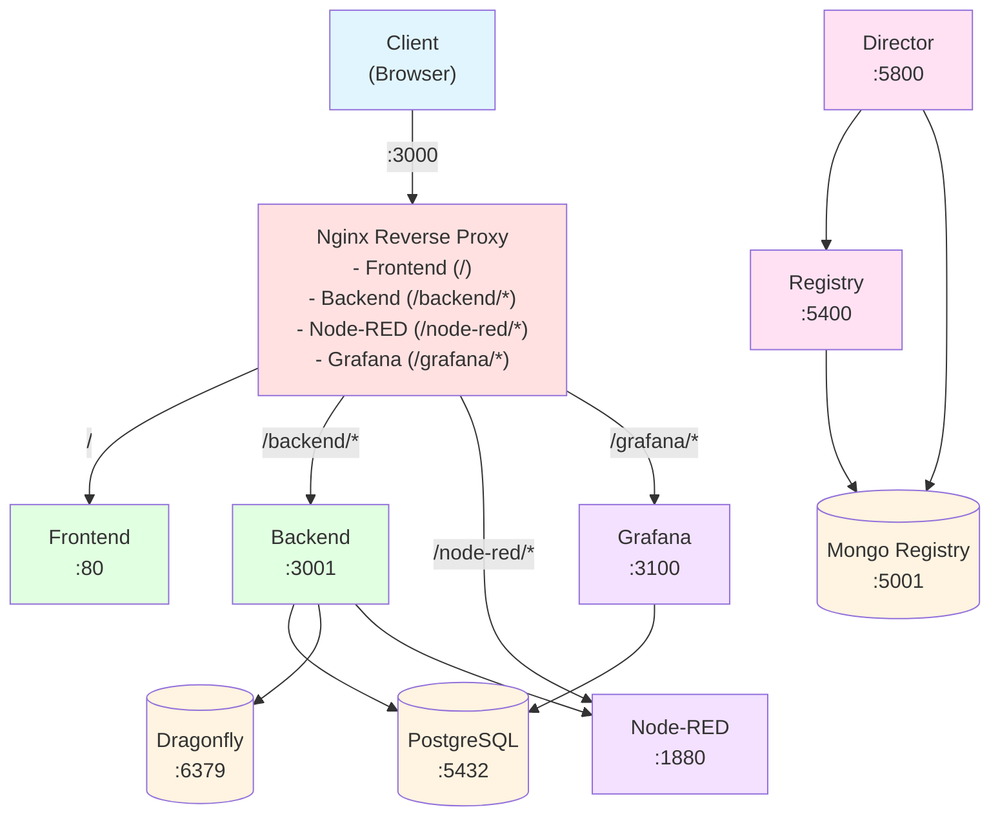
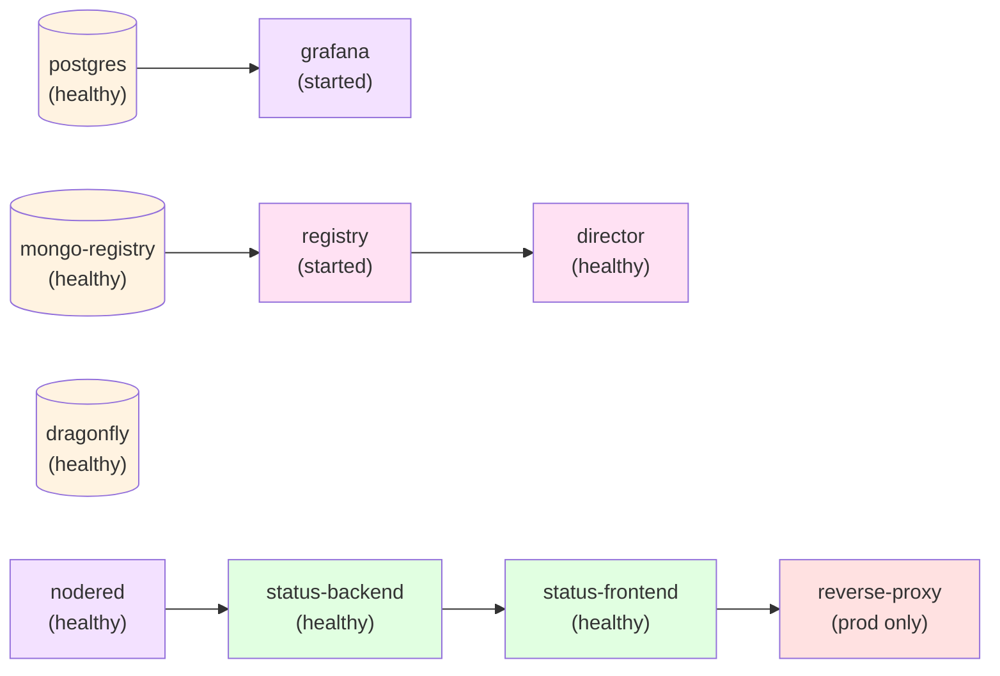

# System Overview

STATUS is a compliance and governance monitoring system built with a microservices architecture using Docker containers. The infrastructure supports two deployment modes (development and production) and integrates multiple specialized services for data management, workflow automation, monitoring, and API services.

## Key Features

- **Microservices Architecture**: Modular design with independent, scalable services
- **Dual Deployment Modes**: Development (local build) and Production (registry images)
- **Automated Workflows**: Node-RED integration for business process automation
- **Real-time Monitoring**: Grafana dashboards with PostgreSQL backend
- **High-performance Caching**: Dragonfly (Redis-compatible) for session and data caching
- **Governance Integration**: Governify director and registry services
- **Container Orchestration**: Docker Compose for simplified deployment

## Technology Stack

| Layer | Technologies |
|-------|-------------|
| **Frontend** | React, Vite, Nginx (production) |
| **Backend** | Node.js, Express |
| **Workflow Automation** | Node-RED |
| **Databases** | PostgreSQL, MongoDB |
| **Caching** | Dragonfly (Redis-compatible) |
| **Monitoring** | Grafana |
| **Governance** | Governify (Director + Registry) |
| **Reverse Proxy** | Nginx (production only) |
| **Orchestration** | Docker Compose |

## High-Level Architecture

## Network Architecture

The infrastructure uses three isolated Docker networks for security and performance:

### 1. web_network
- **Purpose**: Frontend, backend, and proxy communication
- **Connected Services**: status-frontend, status-backend, reverse-proxy, nodered, grafana

### 2. db_network
- **Purpose**: Database services communication
- **Connected Services**: status-backend, postgres, grafana, dragonfly, director, registry, mongo-registry

### 3. nodered_network
- **Purpose**: Node-RED integration network
- **Connected Services**: status-backend, nodered

### Network Isolation Benefits

- **Security**: Services only communicate on required networks
- **Performance**: Reduced broadcast domain size
- **Maintenance**: Easier to troubleshoot and update individual networks
- **Scalability**: Networks can be independently scaled

## Deployment Modes

### Development Mode

- Builds images from local source code
- No reverse proxy (direct port access)
- Hot reload support
- Environment: `NODE_ENV=development`
- Frontend: `http://localhost:3000`
- Backend: `http://localhost:3001`

### Production Mode

- Uses pre-built images from container registries
- Includes Nginx reverse proxy
- Optimized for performance
- Environment: `NODE_ENV=production`
- All services accessible through: `http://localhost:3000`

## Service Dependencies

