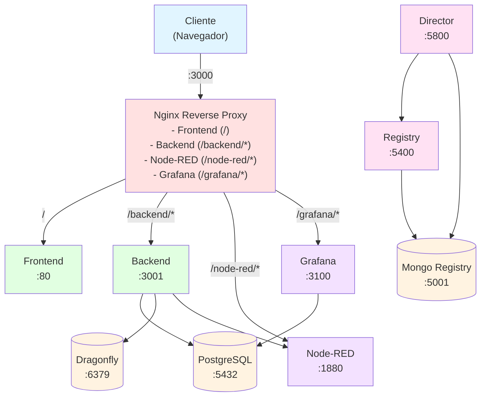
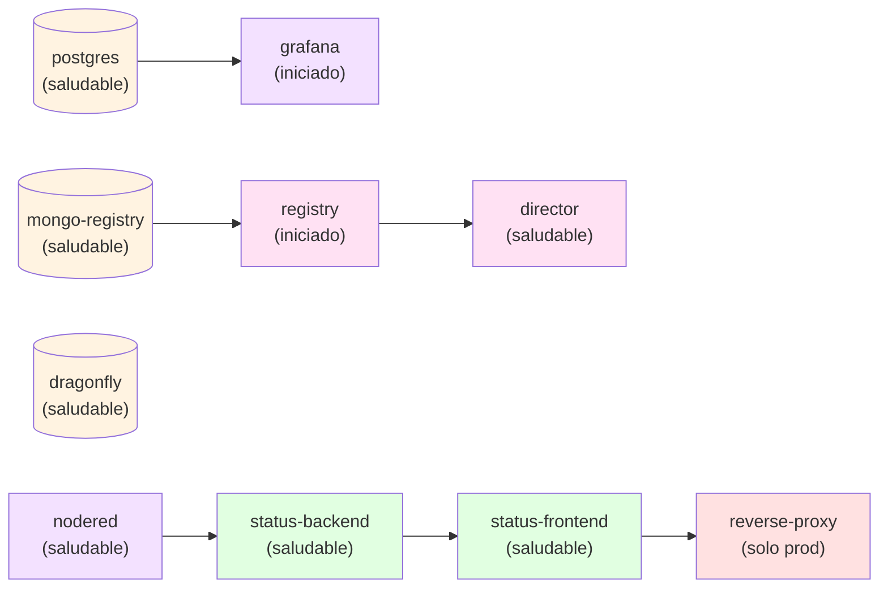

# Resumen del Sistema

STATUS es un sistema de monitoreo de cumplimiento y gobernanza construido con una arquitectura de microservicios utilizando contenedores Docker. La infraestructura soporta dos modos de despliegue (desarrollo y producción) e integra múltiples servicios especializados para gestión de datos, automatización de flujos de trabajo, monitoreo y servicios API.

## Características Principales

- **Arquitectura de Microservicios**: Diseño modular con servicios independientes y escalables
- **Modos de Despliegue Duales**: Desarrollo (construcción local) y Producción (imágenes de registro)
- **Flujos de Trabajo Automatizados**: Integración de Node-RED para automatización de procesos de negocio
- **Monitoreo en Tiempo Real**: Dashboards de Grafana con backend PostgreSQL
- **Caché de Alto Rendimiento**: Dragonfly (compatible con Redis) para caché de sesiones y datos
- **Integración de Gobernanza**: Servicios director y registry de Governify
- **Orquestación de Contenedores**: Docker Compose para despliegue simplificado

## Stack Tecnológico

| Capa | Tecnologías |
|------|-------------|
| **Frontend** | React, Vite, Nginx (producción) |
| **Backend** | Node.js, Express |
| **Automatización de Flujos** | Node-RED |
| **Bases de Datos** | PostgreSQL, MongoDB |
| **Caché** | Dragonfly (compatible con Redis) |
| **Monitoreo** | Grafana |
| **Gobernanza** | Governify (Director + Registry) |
| **Proxy Inverso** | Nginx (solo producción) |
| **Orquestación** | Docker Compose |

## Arquitectura de Alto Nivel

## Arquitectura de Red

La infraestructura utiliza tres redes Docker aisladas para seguridad y rendimiento:

### 1. web_network
- **Propósito**: Comunicación entre frontend, backend y proxy
- **Servicios Conectados**: status-frontend, status-backend, reverse-proxy, nodered, grafana

### 2. db_network
- **Propósito**: Comunicación de servicios de base de datos
- **Servicios Conectados**: status-backend, postgres, grafana, dragonfly, director, registry, mongo-registry

### 3. nodered_network
- **Propósito**: Red de integración de Node-RED
- **Servicios Conectados**: status-backend, nodered

### Beneficios del Aislamiento de Red

- **Seguridad**: Los servicios solo se comunican en las redes requeridas
- **Rendimiento**: Tamaño de dominio de broadcast reducido
- **Mantenimiento**: Más fácil de solucionar y actualizar redes individuales
- **Escalabilidad**: Las redes pueden escalarse independientemente

## Modos de Despliegue

### Modo Desarrollo

- Construye imágenes desde código fuente local
- Sin proxy inverso (acceso directo por puerto)
- Soporte para recarga en caliente
- Entorno: `NODE_ENV=development`
- Frontend: `http://localhost:3000`
- Backend: `http://localhost:3001`

### Modo Producción

- Usa imágenes preconstruidas de registros de contenedores
- Incluye proxy inverso Nginx
- Optimizado para rendimiento
- Entorno: `NODE_ENV=production`
- Todos los servicios accesibles a través de: `http://localhost:3000`

## Dependencias entre Servicios

